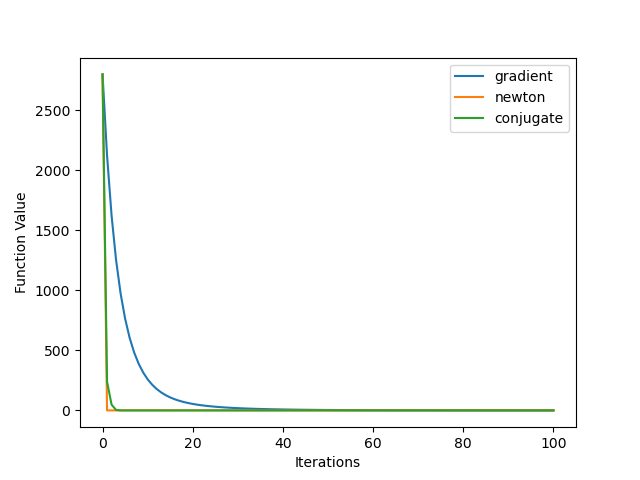

# SearchOptimization
This is a course project of UCSD CSE257 with Prof.Sicun Gao. It includes implementation of following methods:
- **Numerical Optimizers**
  - Gradient based methods: Gradient Descent, Newtown Descent, Conjugate Descent
  - Stochastic methods: Simulated Annealing, Cross Entropy, Search Gradient
- **A-Star Search**
- **Minimax Search**
- **Markov Decision Process**
  - Value Iteration
  - Policy Iteration
- **Reinforcement Learning**
  - Monte Carlo Policy Evaluation
  - Temporal Difference Policy Evaluation
  - Tabular Q learning
  - Deep Q Learning

## Gradient Based Methods:
Import **GradientOptimizer** defined in Numerical_Optimizer.py. To initialize a instance of this class, you only need to tell the target function to be optimized to the class. The operations in the target function must be Pytorch operations. This class has three methods:
- **gradient_descent**(x0,lr,max_iter=100)
- **newton_descent**(x0,lr,max_iter=100)
- **conjugate_descent**(x0,lr=None,max_iter=100)

All of them has three parameters:
- **x0**: initial point, it should have the same format of your target function's input
- **lr**: learning rate, float.
- **max_iter**: max number of iterations, int. The optimization process will stop after max number of iterations even if it doesn't converge.

All of them will return 2 lists:
- **x_history**: the target function's variable values after each descent step.
- **y_history**: the target function's values after each descent step.

Here is a plot of the three methods' optimization process for 

## Stochastic Methods
Import **StochasticOptimizer** from Numerical_Optimizer.py. The initialization is the same as the GradientOptimizer except the target function doesn't have to be Pytorch-based functions. This class has three methods:
- **simulated_annealing**(x0,T0,T_decay_method='fast',gamma=0.8,seed=29,max_iter=100)
  - **x0**: initial point, it should have the same format of your target function's input 
  - **T0**: initial temperature, float.
  - **T_decay_method**: temperature decay method. It should be one of 'fast','exponential','log'
  - **gamma**: decay constant if your T_decay_method is 'exponential', float.
  - **seed**: sample random seed, int.
  - **max_iter**: max number of iterations, int. The optimization process will stop after max number of iterations even if it doesn't converge.
- **cross_entropy**(x0,num_sample,ratio,threshold=0,seed=29,max_iter=100)
  - **x0**: initial point, it should have the same format of your target function's input 
  - **num_sample**: number of samples in each iteration, int
  - **ratio**: ratio of samples used to update the distribution, float
  - **threshold**: float. During the search process, the covariance matrix may become a almost zero matrix. To solve this problem, when sum of the matrix elements' absolute values is no larger than threshold, we set the covariance matrix to be the identity matrix.
  - **seed**: sample random seed, int.
  - **max_iter**: max number of iterations, int. The optimization process will stop after max number of iterations even if it doesn't converge. 
- **search_gradient**(x0,num_sample,lr,seed=29,max_iter=100)
  - **x0**: initial point, it should have the same format of your target function's input 
  - **num_sample**: number of samples in each iteration, int
  - **lr**: learning rate, float.
  - **seed**: sample random seed, int.
  - **max_iter**: max number of iterations, int. The optimization process will stop after max number of iterations even if it doesn't converge.  

Here is a plot of the three methods' optimization process for 

