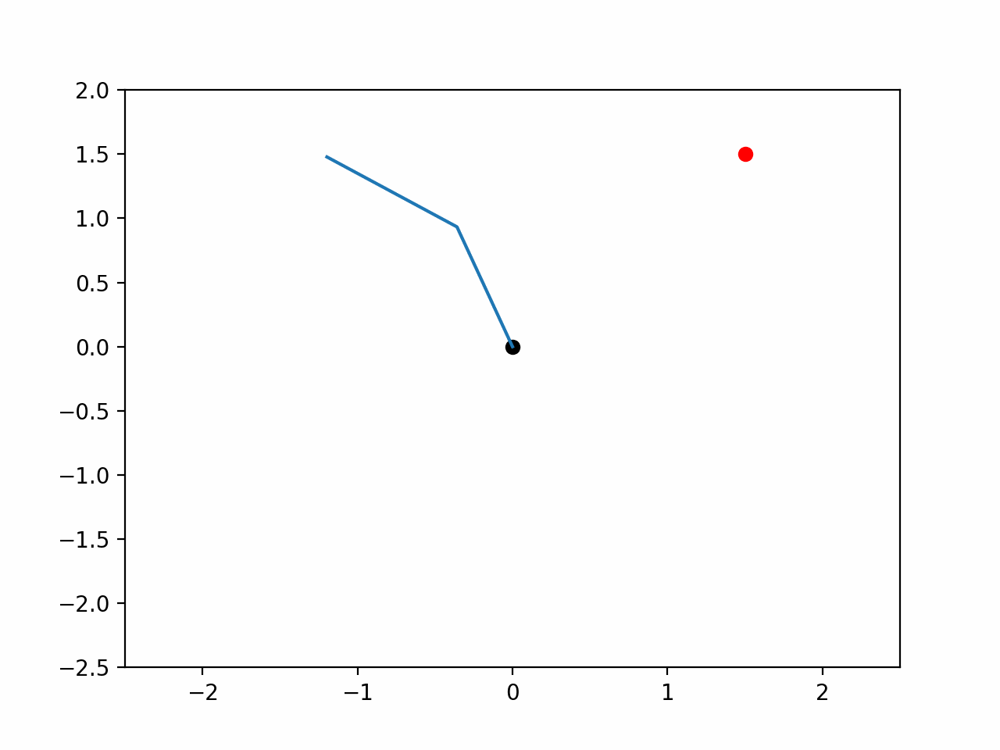

# SearchOptimization
This is a course project of UCSD CSE257 with Prof.Sicun Gao. It includes implementation of following methods:
- **Numerical Optimizers**
  - Gradient based methods: Gradient Descent, Newtown Descent, Conjugate Descent
  - Stochastic methods: Simulated Annealing, Cross Entropy, Search Gradient
- **A-Star Search**
- **Minimax Search**
- **Markov Decision Process**
  - Value Iteration
  - Policy Iteration
- **Reinforcement Learning**
  - Monte Carlo Policy Evaluation
  - Temporal Difference Policy Evaluation
  - Tabular Q learning
  - Deep Q Learning

## Gradient Based Methods:
Import **GradientOptimizer** defined in Numerical_Optimizer.py. To initialize an instance of this class, you only need to tell the target function to be optimized to the class. It works better if the operations in the target function are all Pytorch operations. This class has three methods:
- **gradient_descent**(x0,lr,max_iter=100)
- **newton_descent**(x0,lr,max_iter=100)
- **conjugate_descent**(x0,lr=None,max_iter=100)

All of them has three parameters:
- **x0**: initial point, it should have the same format of your target function's input
- **lr**: learning rate, float.
- **max_iter**: max number of iterations, int. The optimization process will stop after max number of iterations even if it doesn't converge.

All of them will return 2 lists:
- **x_history**: the target function's variable values after each descent step.
- **y_history**: the target function's values after each descent step.

Here is a plot of the three methods' optimization process for 

## Stochastic Methods
Import **StochasticOptimizer** from Numerical_Optimizer.py. The initialization is the same as the GradientOptimizer except the target function doesn't have to be Pytorch-based functions. This class has three methods:
- **simulated_annealing**(x0,T0,T_decay_method='fast',gamma=0.8,seed=29,max_iter=100)
  - **x0**: initial point, it should have the same format of your target function's input 
  - **T0**: initial temperature, float.
  - **T_decay_method**: temperature decay method. It should be one of 'fast', 'exponential', 'log'
  - **gamma**: decay constant if your T_decay_method is 'exponential', float.
  - **seed**: sample random seed, int.
  - **max_iter**: max number of iterations, int. The optimization process will stop after max number of iterations even if it doesn't converge.
- **cross_entropy**(x0,num_sample,ratio,threshold=0,seed=29,max_iter=100)
  - **x0**: initial point, it should have the same format of your target function's input 
  - **num_sample**: number of samples in each iteration, int
  - **ratio**: ratio of samples used to update the distribution, float
  - **threshold**: float. During the search process, the covariance matrix may become a almost zero matrix. To solve this problem, when sum of the matrix elements' absolute values is no larger than threshold, we set the covariance matrix to be the identity matrix.
  - **seed**: sample random seed, int.
  - **max_iter**: max number of iterations, int. The optimization process will stop after max number of iterations even if it doesn't converge. 
- **search_gradient**(x0,num_sample,lr,seed=29,max_iter=100)
  - **x0**: initial point, it should have the same format of your target function's input 
  - **num_sample**: number of samples in each iteration, int
  - **lr**: learning rate, float.
  - **seed**: sample random seed, int.
  - **max_iter**: max number of iterations, int. The optimization process will stop after max number of iterations even if it doesn't converge.  

All of them will return 2 lists:
- **x_history**: the target function's variable values after each descent step.
- **y_history**: the target function's values after each descent step.

Here is a plot of the three methods' optimization process for 

## A-Star
Import **A_star** from ClassicalSearch.py. This class implements A-star search on a 2D map. To initialize an instance, you should input a matrix(2D list) as the maze containing 0 and 1 where 0 represents avaliable locations 1 represents unavailable locations. This class only support 4 actions which are moving left, right, up, down. Use the method **search** to find the best path.
- **search**(x0,target,h):
  - **x0**: a list with the length 2 representing the start point.
  - **target**: a list with the length 2 representing the target point.
  - **h**: your self defined heuristic function.

## Minimax
Import **Minimax** from GameSearch.py. This class implements Minimax search on the [Stone Game](https://leetcode-cn.com/problems/stone-game/). Import Game from GameSearch.py as the game simulator. Note that using dynamic programming, this game's winner can be predicted easily. Using this Minimax class is not the best way to solve the problem, this class aims to show how the algorithm works.

- **Game**: Initialize the class with the list of the stones. It has two methods and 4 useful attributes:
  - **step**(player,head_tail): player should be either 'A' or 'B' indicating the player to take a stone. head_tail should be either 'h' or 't' indicating which stone to take
  - **undo**(): undo the last step.
  - **A**: player A's score.
  - **B**: player B's score.
  - **head**: current index of the head of the stone list.
  - **tail**: current index of the tail of the stone list.
- **Node**: Tree node used for minimax search. It has three attributes:
  - **children**: a list of instances of Node class representing its children nodes.
  - **player**: current player to take the next stone
  - **score**: current player the score
- **Minimax**: Initialize the class with maximum tree layers **layer**(int), which **player**(either 'A' or 'B', 'A' takes the first turn) you are and the game simulator **game**. After initialization, the instance will have a attribute **node**(Instance of class Node) denoting your status at the beginning of the game. The method **minimax** take the starting node as the root and perform the minimax algorithm. To search from the beginning of the game, use the attribute node as the method minimax's input.

## Markov Decision Process
Import **MDP** from MDP.py. 4 parameters are needed to initialize an instance:
- **s_a_dic**: states-actions dictionary. The keys are states, the value for some key is a set containing possible actions under this states.
- **s_r_dic**: states-rewards dictionary. The keys are states, the value for some key is the reward(float or int) of the states.
- **sa_t_dic**: states-actions transition dictionary. The keys are tuples of (state,action), the value for some key is a dictionary whose keys are the possible next states and the values are their transition probabilities.
- **cal_r**: a self-defined function to calculate reward, if passing None to this argument, the reward calculation will simply be key-value query from the s_r_dic.

MDP has 2 useful methods:
- **value_iteration**(threshold,max_iter,gamma,target=None): 
  - **threshold**: float. When all the values' absolute differences between adjacent iterations are smaller than threshold, the iteration stops.
  - **max_iter**: max number of iterations, int. The optimization process will stop after max number of iterations even if it doesn't converge.    
  - **gamma**: discount parameter, float
  - **target**: a list of terminal states. Even if you pass None to this argument, the MDP will know whether a state is a terminal states basing on s_a_dic. This parameter is only needed when your cal_r function needs to know the target states, otherwise you can just pass None. 
- **policy_iteration**(threshold,max_iter_improve,max_iter_evaluation,gamma,target=None): 
  - **threshold**: float. When all the values' absolute differences between adjacent iterations are smaller than threshold, the iteration stops.
  - **max_iter_improve**: max number of iteration for policy improvement, int
  - **max_iter_evaluation**: max number of iteration for policy evaluation, int
  - **gamma**: discount parameter, float
  - **target**: a list of terminal states. Even if you pass None to this argument, the MDP will know whether a state is a terminal states basing on s_a_dic. This parameter is only needed when your cal_r function needs to know the target states, otherwise you can just pass None. 

## Reinforcement Learning
Import **DiscreteRL** from ReinforcementLearning.py. ReinforcementLearning.py also has a class **Environment** to simulate the environment. To initialize Environment, you need to pass s_a_dic and sa_t_dic which are the same of MDP's initialization, also you need to pass cur_state which is the current states of the environment, and target which is a list of terminal states(Unlike in MDP, this time you can not pass None). To initialize DiscreteRL, you need to pass the following parameters: **reward**, **cal_r** which are the same as the s_r_dic and cal_r in MDP, **env** which is an instance of Environment.
 DiscreteRL has 3 useful methods:
- **mc_policy**(policy,gamma,max_iter=100) performing Monte Carlo Policy Evaluation
  - **policy**: a dictionary recording your policy
  - **gamma**: discount parameter, float
  - **max_iter**: max number of iterations, int
- **TD_policy**(policy,gamma,max_iter=100) performing Temporal Difference Policy Evaluation
  - **policy**: a dictionary recording your policy
  - **gamma**: discount parameter, float
  - **max_iter**: max number of iterations, int
- **Q_learning**(gamma,eps,max_iter=100)
  - **gamma**: discount parameter, float
  - **eps**: epsilon value for epsilon-greedy algorithm,float.
  - **max_iter**: max number of iterations, int

## Deep Q-Learning
Import **DQN** from DQN.py. DQN.py also contains a class Net to implement the Deep Neural Networks basing on Pytorch. To initialize DQN, you should pass 5 parameters: 
- **net**: instance of Net. The DNN used to predict the Q-value
- **memory_size**: size of the replay memory, int
- **gamma**: discount parameter, float
- **epsilon**: epsilon value for epsilon-greedy algorithm, float
- **actions**: a list of all the possible actions.
 It has 3 methods:
- **store**(state,action,reward,nstate,terminal) : store a (action,reward,next_state,terminal) tuple in the replay memory
- **act**(state): choosing an action basing on epsilon-greedy algorithm under given state.
- **replay**(batch_size): sample a minibatch from the replay memory and update the DNN

I Designed a simple Mechanical Arm to implement DQN on it. It is defined in MechanicalArm.py. The arm has two sticks of length L=1. The end of one stick is fixed at position (0,0). You can set a target position for the arm. The state is described with two paremeters 
 as shown in the following figure. The black point is the fixed point and the red point is the target point. Each angle has 3 moves: plus 10 degrees, 0 degree or -10 degrees. For each action in our action space, both angles make a move, so our action space contains 3x3=9 actions. The reward is 1/(0.001 + distance to target). You can modify the code to make the arm's moves more accurate(For example, each move turns 1 degree).

Here are two examples of my learning process for target point (1.2, 1.3) and (1.5,1.5)(The arm is not long enough to reach this point). My codes for generation of these gif are in DQN.py.
 target = (1.2, 1.3)

 target = (1.5, 1.5)

